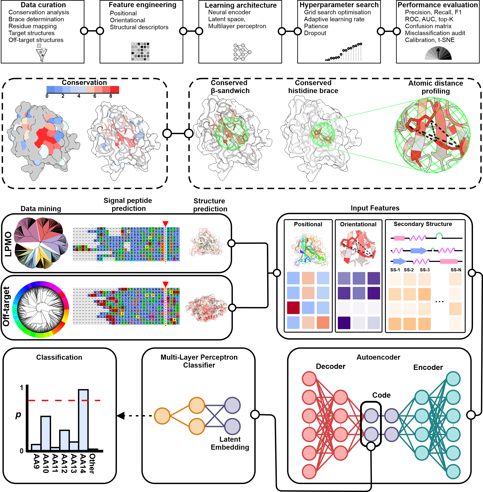

# CONFERS (Conserved Feature Encoding for Recognition of Structures)

Classification prediction of LPMOs from structures using the CONFERS framework



**Installation️**\
CONFERS is cross-platform (Windows, Linux). We recommend using Conda to manage dependencies.

1. Clone the Repository

```bash
git clone https://github.com/leadbot/CONFERS.git
cd CONFERS
```
2. Create the Environment
Choose the one matching your OS:

Linux (Tested on Rocky Linux 8.10 "Green Obsidian"):
```
conda env create -f Environments/CONFERS_unix_fast.yml
```

Windows (Tested on Windows PowerShell 10 / 11):
```
conda env create -f Environments/CONFERS_win_fast.yml
```

4. Activate the Environment
```
conda activate CONFERS
```


**Usage**\
The tool processes a folder of PDB files (e.g., AlphaFold predictions), extracts structural features, and classifies them using a pre-trained AE-MLP model.

**Basic Command**
```
python src/confers.py --pdb_folder Test_pdbs/Test_pdbs_mature_LPMOs_only --outpath test_results --model_name FedeAI_1pt5AEv2 --classification_threshold 0.7 --first_N 3
```

### Arguments & Usage

#### Input/Output
| Argument | Default | Description |
| :--- | :--- | :--- |
| `--pdb_folder` | **Required** | Path to the folder containing `.pdb` files to analyze. |
| `--outpath` | `CONFERS_` | Directory prefix/path where output CSVs and logs will be saved. |
| `--model_name` | `FedeAI_1pt5AEv2` | Name of the subfolder in `Model_data/` containing the trained model. |
| `--file_range` | `None` | Process a subset of files (e.g., `0-100`). Use for parallel array data mining jobs. |

#### Structural Parameters
| Argument | Default | Description |
| :--- | :--- | :--- |
| `--first_N` | `3` | Search for the first Histidine within the first N residues (N-terminal logic). |
| `--max_distance` | `11` | Max allowed distance (Å) between Histidines in the brace. |
| `--min_his_his_dist` | `5` | Minimum sequence distance (residues) between the two Histidines. |
| `--min_beta_strands` | `1` | Minimum number of beta-strands required to consider the fold. |
| `--min_beta_length` | `3` | Minimum number of residues for a valid beta-strand. |

#### Analysis Options
| Argument | Default | Description |
| :--- | :--- | :--- |
| `--deep_learning` | `True` | Perform classification using the neural network (`True`/`False`). |
| `--classification_threshold`| `0.5` | Probability threshold (0.0-1.0) for a positive classification. |
| `--report_secondary_structue`| `True` | Include detailed secondary structure metrics in the output CSV.* |
| `--graphical_output` | `True` | Generate plots for classifications (`True`/`False`).* |
| `--sstype` | `True` | Secondary structure complexity: `True` for simple, `False` for complex (DSSP detailed). |
| `--output` | `True` | Write results to CSV files (`True`/`False`). |
*Turn off for faster analysis


**Models**\
We provide two models:\
Model 1.5 (default; model for mature structures lacking signal peptides, recommended first_N = 3)\
Model 1.6 (model for immature structures with signal peptides, recommended first_N = 30) [IN TESTING]

**Example Workflow IMMATURE STRUCTURES**\
To scan a directory of predicted algal proteins using the pre-trained model:
```
python src/CONFERS.py --pdb_folder Test_pdbs/Test_pdbs_immature --outpath test_results/ --model_name FedeAI_1pt6AE --first_N 30 --max_distance 15 --classification_threshold 0.5 
```

**Outputs**\
The tool generates two primary CSV files in your --outpath:\
\
*_CONFERS_output.csv: Contains the raw data for every protein scanned regardless of classification.\
\
*_CONFERS_classifications.csv: Contains only the proteins identified as targets (e.g., LPMOs) by the deep learning model, along with their predicted family class.\
\
Optional toggle for graphical output to interrogate and interpret classifications.

**Updates/Notes**
Model 1.5v2 is complete.
Model 1.5v2 will be re-trained and updated as and when substrates are found for any new families\.
Model 1.6 (identifying LPMOs that have abberant signal peptides for application to e.g. AlphaFold database) is ongoing\.

**License**\
This project is licensed under the Creative Commons Attribution-NonCommercial 4.0 International License (CC BY-NC 4.0).\
\
Academic/Non-Commercial Use: You are free to use, modify, and distribute this software.\
\
Commercial Use: Commercial use is not permitted under this license. For commercial licensing inquiries, please contact the authors.\
\
See the LICENSE file for details.


